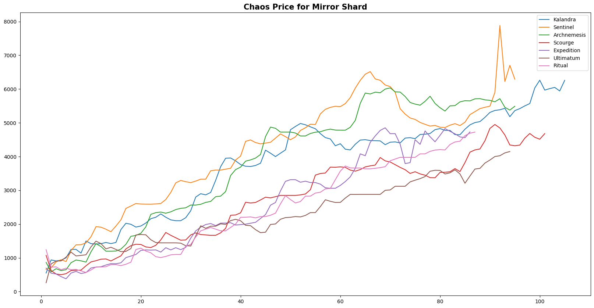
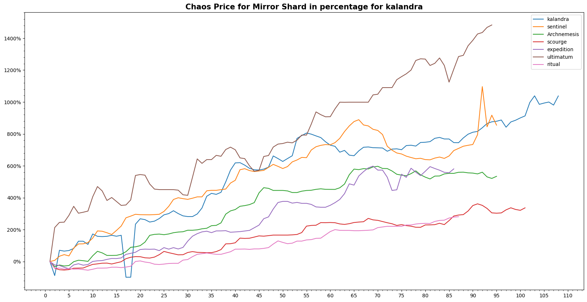
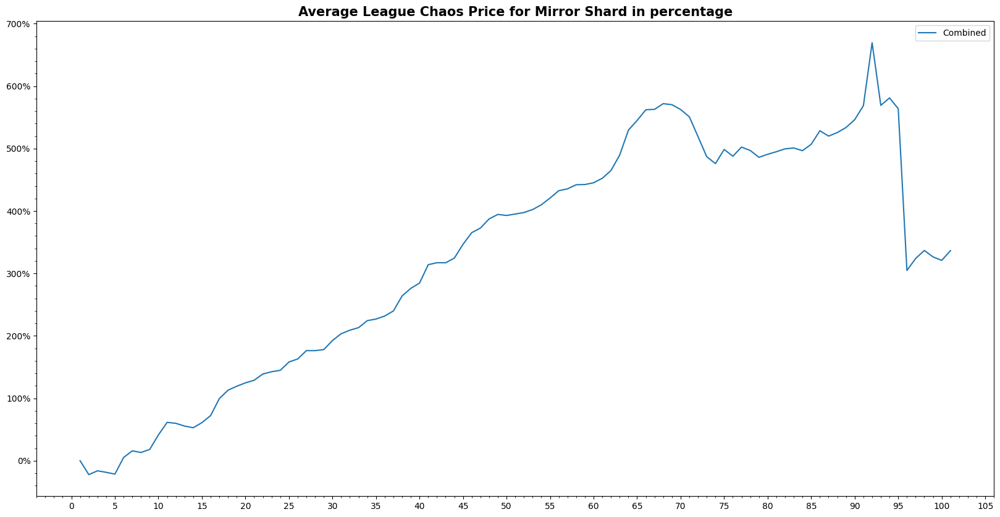
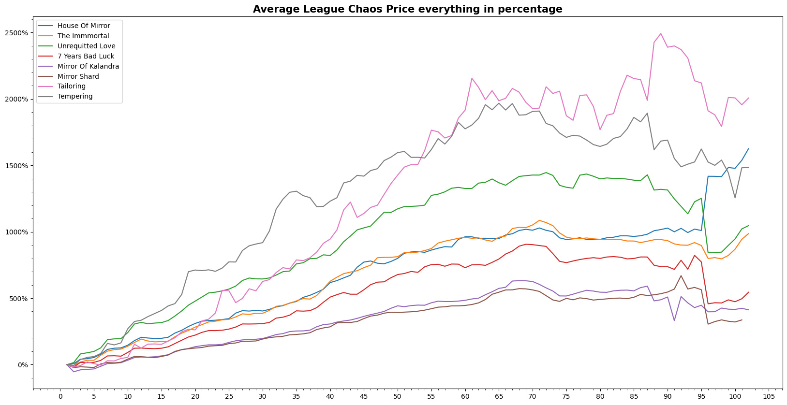

# In-depth Analysis 

<!-- I want to start by acknowledging that my analysis may be influenced by my own biases and personal experiences. While I've done my best to remain objective, I encourage you to approach my analysis with a critical eye and consider any potential biases I may have. 

The prices here are data collected from poe.ninja, and the graphs made are all reference to chaos.  -->

I want to begin by acknowledging that my analysis may be subject to my personal biases and experiences. Despite my efforts to remain objective, I encourage you to approach my analysis critically and to consider any potential biases that may have influenced my conclusions. Please note that the prices presented in this analysis were collected from poe.ninja, and all graphs are in reference to chaos.

  
<strong>Table of Contents</strong>

  <ol>
    <li>
      <a href="#questions-to-answer--hypothesis">Questions to Answer & Hypothesis</a>
      <!-- <ul>
        <li><a href="#built-with">Built With</a></li>
      </ul> -->
    </li>
    <li><a href="#train-of-thought">Train of thought</a></li>
    <li><a href="#decisions">Decisions</a></li>
    <li><a href="#results-for-one item">Results for one item</a></li>
    <li><a href="#replicating-steps">Replicating steps</a></li>
    <li><a href="#results-for-everything">Results for Everything</a></li>
  </ol>

---

## Questions to Answer & Hypothesis

<!-- - What Currency or Divination card has the best return when given the start date and end date ? <a href="#train-of-thought">[1]</a>
    - **Hypothesis** :  I feel that Divine Orb should be the best investment to make at league start.

- Is Mirror Of Kalandra the best return of interest ? As it is the most expensive item for the first few weeks.
    - **Hypothesis** : It should be over time the best thing to invest into, as it is the most expensive item.  

- What happens if the price suddenly had a price jump, because of a buff ?
    - **Hypothesis** :  Would probably need to remove the Data Set for that league. -->

Q: Which Currency or Divination card offers the best return on investment when considering the start and end date? <a href="#train-of-thought">[1]</a>

Hypothesis: Based on my experience of playing the game and return on investment, I hypothesize that Divine Orbs may offer the highest returns at the start of a league.

Q: Is the Mirror of Kalandra the best investment in terms of return on investment, considering its high price during the initial weeks of the league?

Hypothesis: Although the Mirror of Kalandra is expensive at the start of the league, it may prove to be a valuable long-term investment.

Q: What would happen if there were a sudden price jump due to a buff?

Hypothesis: If the price experiences a sudden increase due to a buff, it may be necessary to exclude the corresponding data set for that league.

(<a href="#in-depth-analysis">back to top</a>)

## Train of thought
[1] : 

Original Question : "What is the best thing to invest in to get the highest return ?" 

Too vague, POE has too many factors like 6 - link that is worth at league start. There is also another question: when is your start or end date ? 

(<a href="#in-depth-analysis">back to top</a>)

## Decisions
<!-- I decided to use only one item for trying out first to plot all my graph. I will be using the file mirrorshard.ipynb inside individual files folder. It goes through step by step of how I see and extract the league data out and plot it to see what i can do with it. 

After ploting the chaos value against the date, i realise that in order to combine the different league together I would need to have a common x axis to plot the graph. There the column 'days' was created. By doing that i as able to plot the different leagues into one. And I realised that not much insight was shown here.  -->

I have decided to focus on a single item and use the 'mirrorShard.ipynb' file in the 'Individual Files' folder to explore how to extract league data and plot it. After plotting the item's chaos value against the date, I realized that to combine data from different leagues, I would need a common x-axis. Therefore, I created a 'days' column to enable me to plot data from different leagues on a single graph. However, this did not yield much insight.

---

---

<!-- My end goal was to be able to see the best return of investment and that was not able to shown on the exact graph, therefore i tried using the built in percentage change provided by pandas.
But after plotting it, I realised that the function is only comparing the values to the previous day. Which does not represent anything i had in mind.

I started researching to maybe find mean of the graph so that I can combine and compare the different currency and divination card together. And I read this medium post on [Geometric & Harmonic mean.](https://towardsdatascience.com/on-average-youre-using-the-wrong-average-geometric-harmonic-means-in-data-analysis-2a703e21ea0)

Where I think that if my whole data for a league has the same reference value, in a way I am normalizing my value and when I average the different graph. It changes the graph from a geometric mean with the starting point as the reference value. To a Harmonic mean as im trying to find out the divisory relationship between the geometric mean. 

I had to write a function/method to take the first value of each league data set as a reference value to compare the changes in percentage. And afterwards changing the variable name for other leagues which came out with this graph.  -->

My primary goal was to identify the best return on investment, but I was unable to achieve this with the initial graph. Therefore, I attempted to use the percentage change function provided by Pandas. However, I discovered that this function only compares values to the previous day, which did not meet my needs.

As I continued researching, I came across a Medium post on the [geometric and harmonic mean](https://towardsdatascience.com/on-average-youre-using-the-wrong-average-geometric-harmonic-means-in-data-analysis-2a703e21ea0). After reading it, I realized that if my data for a given league had a common reference value, it could be normalized, and I could then use the harmonic mean to analyze the relationship between the geometric means.

To achieve this, I wrote a function that uses the first value of each league data set as the reference value for comparison in percentage change. By doing so, I was able to generate a new graph that provided the necessary insights.

---

---

<!-- Even though the graph shows similar features but because it was already normalize or rather in geometric mean the difference starts to show that some leagues are better.  -->
 
 Although the new graph exhibits similar features to the original graph, the normalization of data and the use of the geometric mean reveals differences between leagues that were not previously apparent. By comparing the harmonic mean of the normalized data, I was able to determine which leagues yielded the best return on investment

(<a href="#in-depth-analysis">back to top</a>)

## Results for one item 

To enable comparison of the prices of a single item across different leagues, I took the mean of the prices for each league and combined them. This allowed me to obtain an overall average price for the item that I could use for comparison purposes. By doing so, I was able to determine which leagues had the highest and lowest prices for the item, and also to identify any trends or patterns in the pricing data over time.

The picture shown below is one of the example that I have done for mirrorShard.ipynb. 

(<a href="#in-depth-analysis">back to top</a>)

## Replicating steps

To replicate the steps taken for a single item across all eligible items, I first ensured that I had taken into consideration any factors that may affect the prices, such as popularity and rarity. I then extracted and normalized the price data for each item from multiple leagues and combined them using the harmonic mean to obtain an overall average price. By doing so, I was able to compare the prices of each item across leagues and over time, and identify any significant changes or trends. 

This allowed me to determine which items were the most profitable to invest in at different stages of the league, and to make data-driven decisions when it came to investing in different items.

As the document would be too lengthy if I were to include all the corresponding pictures, you may refer to the corresponding notebook for further testing and verification purposes. 

(<a href="#in-depth-analysis">back to top</a>)

## Results for Everything

<!-- write a analysis statement where i am combining all the results that i have from replicating steps to combine them to find out what is the actual most profitable item which is the unrequited love for the first 10 days, which the tempering orb will overtake it afterwards with a steeper increase. 

and 
- What Currency or Divination card has the best return when given the start date and end date ? 
    - This depends on when is the start date choosen, for example if its league start to the 10th day, unrequited love divination card would be the best choice. But for things afterwards tempering orb. (For this part i would have to implement the ability to be able to choose or an interactive notebook style. More reserach on this is needed)

- Is Mirror Of Kalandra the best return of interest ? As it is the most expensive item for the first few weeks.
    - In a way yes, because by investing into unrequited love divination card is indirectly investing in the end product of 19 mirror shard. 

- What happens if the price suddenly had a price jump, because of a buff?
    - This would not affect the currency or divination card, as Path of Exile is a game where the value is tied to the currency, so unless they change the drop rate to increase for divination card or enable tempering orb to drop elsewhere, i would not forsee the price to change that drastically. -->

After replicating the steps for all eligible items and combining the results, it appears that the most profitable item depends on the timeframe considered. For the first 10 days of a league, investing in Unrequited Love divination card yields the highest returns. However, after the first 10 days, the Tempering Orb becomes the best investment with a steeper increase. Therefore, it is important to consider the time frame when choosing which item to invest in for maximum returns.

---
Q: What Currency or Divination card has the best return when given the start date and end date ? 

A: The best currency or divination card with the highest return depends on the selected start and end dates. For instance, if the period is from the league start to the 10th day, the most profitable option would be the Unrequited Love divination card. However, for dates after that, the Tempering Orb would yield a higher return. To enable users to choose the appropriate date range, an interactive notebook style or further research would be required.

Q: Is Mirror Of Kalandra the best return of interest ? As it is the most expensive item for the first few weeks.

A: While the Mirror of Kalandra is the most expensive item for the first few weeks, the most profitable investment strategy is indirectly investing in the end product of 19 Mirror Shards through the Unrequited Love divination card.

Q: What happens if the price suddenly had a price jump, because of a buff?

A: It is unlikely that sudden price jumps due to game buffs would significantly affect the prices of currency or divination cards, as the value is tied to the in-game currency. Therefore, unless the drop rate for divination cards or Tempering Orbs changes, or they become available in other areas of the game, I would not expect the prices to change drastically.

(<a href="#in-depth-analysis">back to top</a>)

