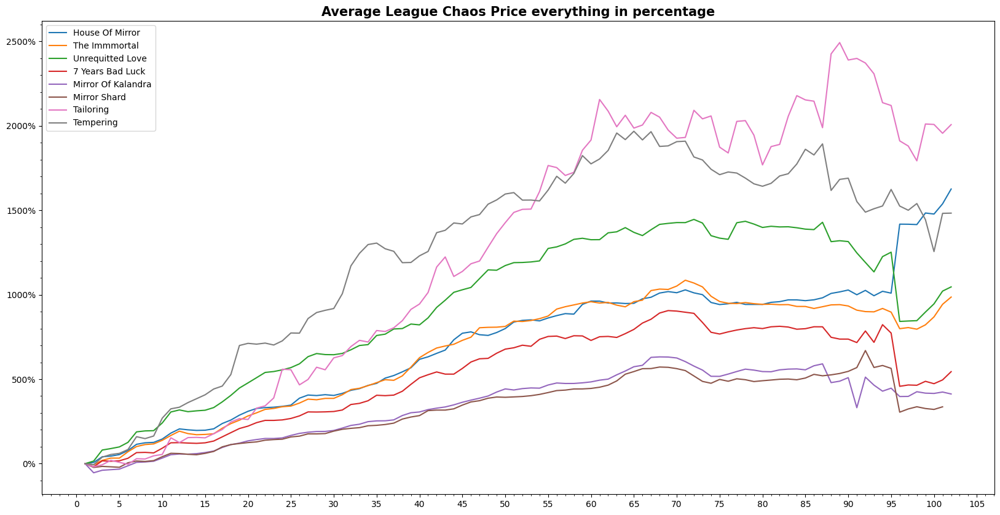

# POE-Market-Price-Analysis


## Project Description
---
Analysing the Path of Exile martket, as a player, you want to make sure that you get the most value for your investment. In this analysis, we will use data from past leagues to determine which currency or divination card to purchase to have the best return of interest. However, we will exclude data from the current league, as the prices of items can vary greatly between leagues.
 
*This Analysis has been done in **Sanctum League***

To conduct this analysis, I utilized Python, along with the popular data analysis libraries, Pandas and Numpy. I also plotted the data using the Matplotlib library. One of the main challenges I faced during this analysis was ensuring the accuracy of the data, where data might be skewed to the sudden buff or nerf of a certain item.

As a result, I had to carefully consider the leagues which I have to exculde from the collected data, and also ensure that I was not including data from the current league, as this could skew the results. Overall, with the help of Python and the data analysis libraries, I was able to conduct a thorough analysis of past league data in Path of Exile, providing players with valuable insights on how to maximize their return on investment.
<p align="right">(<a href="#poe-market-price-analysis">back to top</a>)</p>

<details>
  <summary><strong>Table of Contents</strong></summary>
  <ol>
    <li>
      <a href="#project-description">Project Description</a>
      <!-- <ul>
        <li><a href="#built-with">Built With</a></li>
      </ul> -->
    </li>
    <li>
      <a href="#getting-started">Getting Started</a>
      <ul>
        <li><a href="#prerequisites">Prerequisites</a></li>
        <li><a href="#installation">Installation</a></li>
      </ul>
    </li>
    <li><a href="#executing-the-program">Executing the program</a></li>
    <li><a href="#analysis-on-the-following-item">Analysis on the following item</a></li>
    <li><a href="#in-depth-analysis">In-depth Analysis</a></li>
    <li><a href="#credits">Credits</a></li>
    <!-- <li><a href="#contact">Contact</a></li>
    <li><a href="#acknowledgments">Acknowledgments</a></li> -->
  </ol>
</details>

---
## Getting Started
---
Firstly I have removed the CSV file that contains the items section to be uploaded. 
Because it is too big and i would have to pay for me to upload. For those that want to run this notebook please go ahead follow the steps and download the files

- Create a folder name **Items** in the same directory as the original notebook.

- Download the zipped files for the different leagues from the following link, these are api links from poe.ninja
    - [Kalandra](https://poe.ninja/api/data/getdump?name=Kalandra)
    - [Sentinel](https://poe.ninja/api/data/getdump?name=Sentinel)
    - [Archnemesis](https://poe.ninja/api/data/getdump?name=Archnemesis)
    - [Scourge](https://poe.ninja/api/data/getdump?name=Scourge)
    - [Expedition](https://poe.ninja/api/data/getdump?name=Expedition)
    - [Ultimatum](https://poe.ninja/api/data/getdump?name=Ultimatum)
    - [Ritual](https://poe.ninja/api/data/getdump?name=Ritual)

- Or for more data set directly from their website [poe.ninja](https://poe.ninja/data)
- Extracting their specific league file type to their respective folder
    - e.g. Kalandra.currency.csv to Currency folder
    - e.g. Kalandra.items.csv to Items folder

<p align="right">(<a href="#poe-market-price-analysis">back to top</a>)</p>

## Executing the program
---
- Run the Important_Item.ipynb after selecting the kernel that you wished to use.
- This analysis contains only a few items, you are welcome to add in more stuff.
- Change the following **league** and **item** to your choice.

```python
kalandra = kalandra_items.loc[kalandra_items['Name']=='House of Mirrors']
```
- Inside Individual Files, contains the files for some of the individual currency analysis and results

<p align="right">(<a href="#poe-market-price-analysis">back to top</a>)</p>


## Analysis on the following item
---


Currency or Divination card that have been done.
- Currency:
    - Tailoring Orb
    - Tempering Orb 
    - Mirror Shard 
    - Mirror 
    - Secondary Regrading Lens* 
- Divination Card:
    - Mirror Card:
        - House of Mirrors
        - The Immortal 
        - Seven Years Bad Luck
        - Unrequited Love 
    - MageBlood(MB) Card:
        - The Apothecary*
        - The Insane Cat*
        - The Price of Devotion*
    - HeadHunter(HH) Card:
        - The Doctor* 
        - The Fiend*
        - The Demon*

The ones with * has not been analyse or presented as important item.

For HH after the rework it only has 2 leagues worth of data, and in Kalandra League because of the Loot Globin, everyone is equipping Quantity Gear and to get higher Damage Per Second(DPS) and survivability they are using HH.

For the 2 Mageblood Card, it is only released in Sanctum League which at the point of analysing, I do not have the data set included.

But I would not advise to invest in The Apothecary card as two leagues worth of data is not sufficient to come up with decent information. 

The same reason goes for Divine Orb, which is change for 2 leagues.
<p align="right">(<a href="#poe-market-price-analysis">back to top</a>)</p>

## In-depth Analysis
---
FAQ on why I take certain steps, and my initial train of thoughts and mistakes. ->
[Here](Kal-Sen-Arch-Scourge-Exp-Ult-Ritual.txt)

An Indepth analysis ->
[Here]()
<p align="right">(<a href="#poe-market-price-analysis">back to top</a>)</p>

## Credits
---
Thanks to poe.antiquary for the idea and poe.ninja for providing the data dumps
<p align="right">(<a href="#poe-market-price-analysis">back to top</a>)</p>
